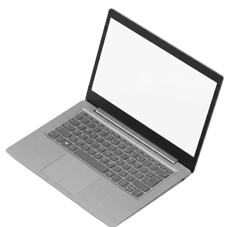

<div align="center">
  
  <h1>Interactive Desktop Portfolio</h1>
  <p>A personal portfolio built to look and feel like a real operating system, right in your browser.</p>
</div>

---

## 👋 About Me
Hello! I am **Hakien**, a **Product Designer & Developer**. 
I believe that the best digital experiences are the ones that feel natural and intuitive. My goal is to transform complex systems into simple, beautiful, and engaging products. Through product design, information architecture, and visual craft, I try to bring a touch of human warmth into the digital world.

---

## 🌟 About This Project
This project is not just a standard website—it is an **Interactive Desktop Environment**. I wanted to build a space that feels like you are sitting at my actual computer. You can drag windows around, draw on sticky notes, flip through my diary, and explore my projects exactly as if you were using a real operating system like macOS or Windows.

### ✨ Key Features
- **🖥️ Desktop Interface:** A full-screen experience where you can drag and move icons and windows freely.
- **🎨 Project Showcase (Gallery):** A beautiful glass-like window to explore my latest designs and applications, complete with filters and direct links.
- **📖 3D Digital Flipbook:** A realistic, interactive book that you can flip through to read my visual diary and thoughts. The pages bend and cast shadows just like real paper!
- **📝 Live Notebook:** A markdown-style notepad where you can read my design philosophies.
- **🖌️ Drawing Stickies:** A digital sticky note with a built-in drawing canvas. You can pick up a pen, choose colors, and sketch your ideas directly on the screen.
- **💾 Live Edit & Auto-Save:** Almost all text and images in this portfolio can be edited on the fly (by double-clicking or typing). Everything you write or draw is automatically saved to your browser!

---

## 🛠️ Technology Stack
This project was built entirely from scratch without using heavy modern frameworks (like React or Vue). This ensures it runs extremely fast and smooth for everyone.

* **HTML5 & CSS3:** For the structure and beautiful styling. I used modern CSS techniques like **Glassmorphism** (frosted glass effects), Flexbox, and CSS Grid to create the premium operating system look.
* **Vanilla JavaScript (ES6):** All the logic—from dragging windows, switching tabs, filtering projects, to saving data—is written in pure JavaScript, organized neatly into modules.
* **HTML5 Canvas API:** Used to power the interactive drawing tools on the Sticky Notes.
* **Web Storage API (LocalStorage):** This is the magic behind the "Live Edit" feature. It saves your edits and drawings directly inside your browser so they are never lost when you refresh the page.
* **Page-Flip Library:** A lightweight library used to simulate the realistic 3D page-turning physics for the Flipbook.

---

## 🚀 How to Run Locally
If you want to run this project on your own computer:
1. Make sure you have [Node.js](https://nodejs.org/) installed.
2. Open your terminal/command prompt.
3. Run the following command in the project folder:
   ```bash
   npx serve -l 3000
   ```
4. Open your web browser and go to: `http://localhost:3000`

---
*Crafted with passion by Hakien © 2026*
